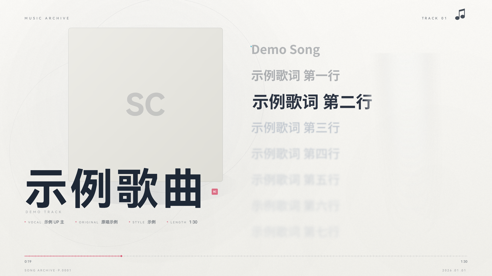

# vtuber-song-cutter

把**直播录播**自动切成**单曲歌切**，并渲染成带同步歌词的 4K60 视频。

输入 `录播 MP4 + 转写 SRT + 当日歌单`，输出 `成片 MP4 + 音频 + 验收清单`。
全流程无人值守：自动找歌、精切切点、匹配歌词封面、渲染画面、混流编码、规格校验。

> 最初为一位虚拟主播的直播录播而写，现已把主播身份、本机路径、数据源地址全部
> 外置为 `config.json`，可给任意主播/任意录播使用。仓库内不含任何真实素材。



*上图为中性示例（合成音频 + 占位素材），非真实内容。*

---

## 它解决什么问题

直播录播动辄四五小时，一场可能唱了十几首。手工切歌的麻烦在于：

| 痛点 | 本项目的做法 |
|---|---|
| 一首歌从哪开始？直播里歌与歌之间夹着闲聊 | 说话段 → 静音谷 → 能量回升的三段式切入点检测，并用波形包络精修边界 |
| 唱的是哪首歌？歌名靠听容易错 | 在线歌单表（权威）+ LLM 联网核对 + 曲库模糊匹配，三方交叉验证 |
| 歌词怎么对上时间轴？ | 原曲 DTW 对齐；拿不到原曲时退化为 ASR 组边界 + 字数摊分 |
| 切出来的画面太素 | 逐帧渲染的播放器界面：封面取色背景、卡拉OK 逐字填充、标题装饰自动匹配 |
| 上传后被平台二次压缩糊掉 | 走 ffmpeg 恒定码率（4K 默认 NVENC 硬编），钉在平台「不二压」安全区间 |

---

## 快速上手

### 1. 依赖

```bash
# Python
python -m pip install -r requirements.txt

# Node 侧（无头浏览器渲染）
npm i playwright
npx playwright install chromium
```

还需要 **ffmpeg / ffprobe**（建议 6.0+，含 libx264）。装好后确保在 `PATH` 中，
或把绝对路径填进 `config.json` 的 `runtime.ffmpeg` / `runtime.ffprobe`。
> 4K 导出**必须**有 ffmpeg —— 原因见下文「为什么要绕道 ffmpeg」。

### 2. 配置

```bash
cp config.example.json config.json
```

`config.json` 是**唯一**存放个人信息的文件（已被 `.gitignore` 忽略）。
最少需要填这几项：

| 配置项 | 说明 |
|---|---|
| `recording_root` | 录播归档根目录，其下按日期建子目录存 MP4 |
| `srt_dir` | 上游转写产物（`*.srt`）所在目录 |
| `streamer.name` | 演唱者名，会写进画面档案行与文件名 |
| `llm_config` 或 `llm.api_key` | 用于识别歌曲的大模型凭据 |

其余项都有通用默认值，不填也能跑（会以降级方式运行并打印提示）。

### 3. 准备素材

```
<recording_root>/
└── 2026-01-01/
    └── 录制-20260101-xxxx_compressed.mp4      # 当天录播

<srt_dir>/
└── 2026-01-01.srt                             # 当天转写（全场统一时间轴）
```

转写文件需要是**与视频 0 点对齐**的整场时间轴。若你还没有转写环节，
可以让 SRT 只覆盖唱歌附近的时间段，管线会在缺段时降级处理。

### 4. 跑

```bash
python song_cutter.py --date 2026-01-01 --dry-run    # 先只识别，确认歌单
python song_cutter.py --date 2026-01-01              # 正式出片
```

产物落在 `<workdir>/cuts/<date>/`：

```
cuts/2026-01-01/
├── 【示例UP主】歌名【20260101歌切】.mp4     # 成片（默认 4K60）
├── 【示例UP主】歌名【20260101歌切】.mp3     # 音频
├── manifest.json                            # 全部元信息与验收数据
└── cutter.log                               # 运行日志
```

常用参数：

```bash
--dry-run              # 只识别不切割
--redetect             # 强制重跑 LLM 识别
--limit 3              # 只切前 3 首（调试）
--res 1                # 输出 1080P（渲染快约 4 倍）
--bitrate 12000000     # 自定义视频码率
--perf-no 3407         # 第 N 次演唱 → 画面左下角写 <前缀>·P.3407
--scheme 0..4          # 手动指定标题装饰方案
--keep-mp3             # 保留中间音频
--raw-cut              # 旧档：直接切源视频画面，不做播放器渲染
```

---

## 工作流程

```
 录播 MP4 ─┐
 转写 SRT ─┼─► ① 找歌 ──► ② 精切 ──► ③ 歌词/封面 ──► ④ 渲染 ──► ⑤ 混流校验
 当日歌单 ─┘     │          │            │              │            │
                 │          │            │              │            └─ ffprobe 规格 + 码率验收
                 │          │            │              └─ 逐帧画布 → ffmpeg 编码
                 │          │            └─ LRCLIB → 网易云 → DTW/ASR 同步
                 │          └─ 包络精修 + 切入点检测（说话段→静音谷→回升）
                 └─ 在线歌单表 + LLM 联网核对 + 曲库模糊匹配，三方交叉验证
```

| 阶段 | 模块 | 说明 |
|---|---|---|
| ① 找歌 | `song_cutter.py` | 歌单表给"应该唱了什么"，LLM 在转写里找"实际在哪"，两边对账 |
| ② 精切 | `wave_refine` `onset_v2` `timeline_sync` | 包络定位伴奏起点；三段式检测找回被截掉的前奏 |
| ③ 歌词 | `lyrics_fetch` `lyrics_sync` `ctc_align` `lyric_align` | 匹配歌词与封面；DTW 精确同步，无原曲时降级 |
| ④ 渲染 | `renderer/render_song.cjs` + `renderer/player/index.html` | 无头浏览器逐帧绘制，ffmpeg 编码 |
| ⑤ 校验 | `song_cutter.py` | 分辨率/帧率/码率/音画偏差，不达标即报错 |

---

## 目录结构

```
.
├── song_cutter.py              主入口：编排全流程
├── songcut/                    核心算法模块
│   ├── config.py               集中配置（读 config.json / 环境变量）
│   ├── lyrics_fetch.py         歌词与封面匹配（LRCLIB → 网易云）
│   ├── lyrics_sync.py          DTW 精确同步（需原曲参考音频）
│   ├── lyric_align.py          ASR 配对 + 聚类常数偏移
│   ├── ctc_align.py            CTC 强制对齐（词级时间戳）
│   ├── timeline_sync.py        切入点检测 + 时间轴同步编排，失败自动降级
│   ├── onset_v2.py             切入点检测 v2（说话段→静音谷→能量回升）
│   ├── wave_refine.py          波形边界精修
│   ├── vocal_activity.py       人声活动分析（VAD）
│   ├── decor_pick.py           标题装饰方案自动匹配
│   ├── verify_sync.py          同步质量验收
│   └── transcript_hub.py       转写源编排（盘点/定位/健康检查/降级）
├── renderer/
│   ├── render_song.cjs         离线逐帧渲染驱动器
│   ├── kdocs_fetch.cjs         在线歌单表抓取
│   └── player/
│       ├── index.html          播放器界面 + 逐帧渲染模块（渲染底座）
│       ├── mp4-muxer.js        MP4 封装（回退档用）
│       ├── fonts/              离线字体（Noto Sans SC / HarmonyOS Sans SC）
│       └── assets/             占位贴图与水印（可替换）
├── tools/                      诊断与验收脚本
│   ├── shot_frame.cjs          指定帧渲染（含编码器基准）
│   ├── bench_bitrate.cjs       长时码率基准
│   ├── probe_lyric.cjs         歌词逐帧探针（查帧间闪烁）
│   ├── probe_frame.cjs         嫌疑帧全画布 diff
│   ├── verify_output.py        成片规格 + 画质验收
│   └── compare_encode.py       编码路线画质对照
└── docs/                       设计文档（中文）
```

---

## 配置项

`config.json` 全部键（未填则用代码内置的通用默认值）：

| 键 | 说明 |
|---|---|
| `workdir` | 工作目录，产物写 `<workdir>/cuts/<date>/`；留空用仓库根 |
| `recording_root` | 录播归档根目录 |
| `srt_dir` | 转写 SRT 目录 |
| `llm_config` | 外部 LLM 配置文件路径（沿用其 `summarize` + `paths` 结构） |
| `song_library_json` | 曲库 JSON（歌名候选集，可选） |
| `songlist.url` / `.sheet_index` / `.ttl_hours` | 在线歌单表地址、表序号、缓存有效期 |
| `streamer.name` | 演唱者名（档案行 VOCAL、文件名、ID3） |
| `streamer.archive_prefix` | 左下角档案号前缀 |
| `streamer.badge` | 刊眉带品牌签名 |
| `streamer.mark` | 品牌短标记（题饰 / 封面占位） |
| `streamer.art_image` | 右侧装饰立绘（可留空） |
| `assets.sticker` / `.watermark` | 贴图与水印素材（留空用自带占位图） |
| `runtime.node` / `.node_modules_path` | Node 可执行文件与依赖目录 |
| `runtime.ffmpeg` / `.ffprobe` | ffmpeg / ffprobe 路径 |
| `credentials.netease_cookie_file` | 网易云 cookie（仅用于拉取付费曲的逐字歌词，缺失自动降级） |
| `credentials.glm_credentials_file` | 备用 LLM 通道凭据 |
| `llm.*` | 无 `llm_config` 时使用的模型配置 |
| `transcript.*` | 转写兜底管线与历史档案目录 |

也可以用环境变量覆盖：`SONGCUT_CONFIG`（配置文件路径）、`SONGCUT_NODE`、`FFMPEG_BIN`、`FFPROBE_BIN`。

---

## 关键技术点

### 为什么要绕道 ffmpeg

渲染本来可以交给浏览器自带的 WebCodecs 编码器。但实测发现：**Chromium 的软件
H.264 编码器在静态内容上码率控制会饱和**——无论把目标码率设成 18 Mbps 还是
40 Mbps，实际产出都只有 4~6 Mbps，`bitrateMode:'constant'` 也被忽略。

而主流平台对「低于阈值」的投稿会二次压缩画质。所以渲染器改成：
**画布逐帧导出 JPEG(q98) → 本地 HTTP 推给 Node → ffmpeg 恒定码率编码**（4K 默认
NVENC 硬编 `h264_nvenc p1`，实测与 x264 fast 画质持平：PSNR 46.2 dB / SSIM 0.982，
快 3.3×；⚠ NVENC 不写 transfer/primaries 的 VUI，需 `h264_metadata` bsf 补齐）。
这样码率能精确钉住，文字边缘也不糊。

（选 JPEG 而非 PNG 是因为实测 4K 单帧 PNG 约 10 MB，全片中间件要 190 GB；
JPEG q98 只要 1.8 MB，画质回环 PSNR 仍有 40 dB。）

### 4K 渲染提速：多实例分段 + 两阶段编码

单实例的瓶颈是 `cv.toBlob`（4K 约 72 ms/帧，Canvas→JPEG 在进程内无法并行化：
Worker 池 + OffscreenCanvas 实测反而更慢）。有效做法（`--pages N`）：

1. **多 Chromium 实例分段渲染**：每个实例从 f0 顺序快进到自己的起点
   （绘制仅 0.3 ms/帧，但歌词排版有跨帧累积状态、不能真正并行绘制），
   再只编码自己的段。实测聚合吞吐 1→13 / 2→21 / 3→34 fps。
2. **两阶段**（≥2 实例自动启用）：实测任何编码进程与渲染实例并存都会互拖
   （NVENC 版 13 fps、x264 版 7.5 fps，而纯渲染 33.7 fps、纯编码 50 fps）。
   故先把各段 JPEG 落盘，渲染完成后关闭浏览器，再并行 NVENC 编码各段
   （收紧 GOP 保证拼接边界落在 IDR 上）+ `concat -c copy` 拼接。

160 s 的 4K60 曲子：单实例 x264 约 12 min → P=2 两阶段 NVENC 约 9 min。
机械盘（~30 MB/s 顺序写）会成为落盘阶段下限；SSD 上可再试 `--pages 3`。

### 输出倍率无关渲染

同一套绘制代码要同时支持 1080P 和 4K。做法是：**设计坐标恒为 1920×1080**，
输出分辨率由 `?res=1|2` 控制，靠画布放大 + 一次 `setTransform` 整体缩放。

需要注意三个**在设备像素而非用户空间**的量，必须手动乘倍率补偿：模糊滤镜半径、
阴影半径、颗粒噪声纹理；贴图栅格也要按倍率超采样。

### 切入点检测

直播里歌的开头常被说话声盖住，直接按能量阈值切会把前奏切掉。检测分三段：
**说话段 → 静音谷 → 能量回升**，多阈值取候选谷，再做局部验证（对比度、回升幅度、
回升持久性、回升后连续活动时长），最后回退到谷底 +2dB 作为渐强的物理起点。

---

## 已知限制

- **强依赖转写时间轴**。没有 SRT 就只能在整场音频上盲搜，误检率上升。
- **DTW 同步需要原曲参考音频**。付费曲拿不到原曲时会降级到 ASR 摊分，
  行级误差约 0.3~1.5 秒。
- **4K 渲染较慢**。瓶颈在 Canvas→JPEG（单帧约 72 ms，进程内不可并行）；多实例分段 +
  两阶段 NVENC 可提速约 25%（P=2），见「4K 渲染提速」一节。1080P 快约 4 倍。
- **平台码率阈值会变**。代码里的默认值来自一次实测，请按自己平台的当期规则调整
  `--bitrate`。码率越高体积越大（4K 18 Mbps 的 5 分钟视频约 650 MB）。
- **歌词与封面来自第三方接口**，可用性与准确性不受本项目控制；取不到时自动降级。

---

## 文档

- [`docs/architecture.md`](docs/architecture.md) —— 架构与依赖解耦方案
- [`docs/dependencies.md`](docs/dependencies.md) —— 链路逐环依赖分析、去 ASR 可行性
- [`docs/transcript-pipeline.md`](docs/transcript-pipeline.md) —— 转写接入设计（上游优先）

## 许可

[MIT](LICENSE)。随仓库分发的字体与第三方代码见 [THIRD_PARTY_NOTICES.md](THIRD_PARTY_NOTICES.md)。

本仓库只包含工具链，不含任何录音、歌曲音频、成片或第三方美术资源。
通过接口获取的歌词与封面版权归原权利人所有，请自行确保对处理素材拥有相应权利，
并遵守所在平台的服务条款。
